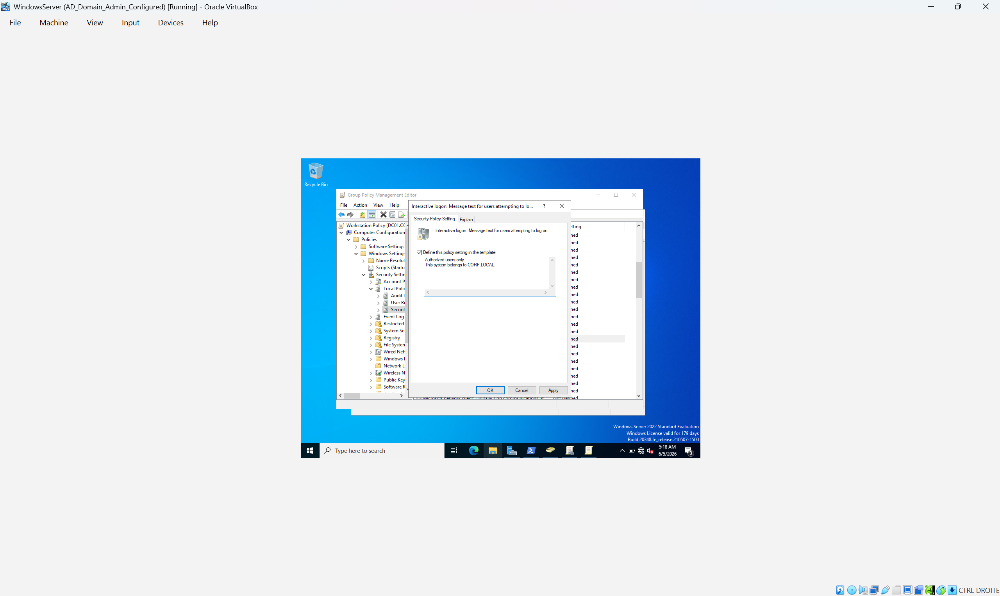
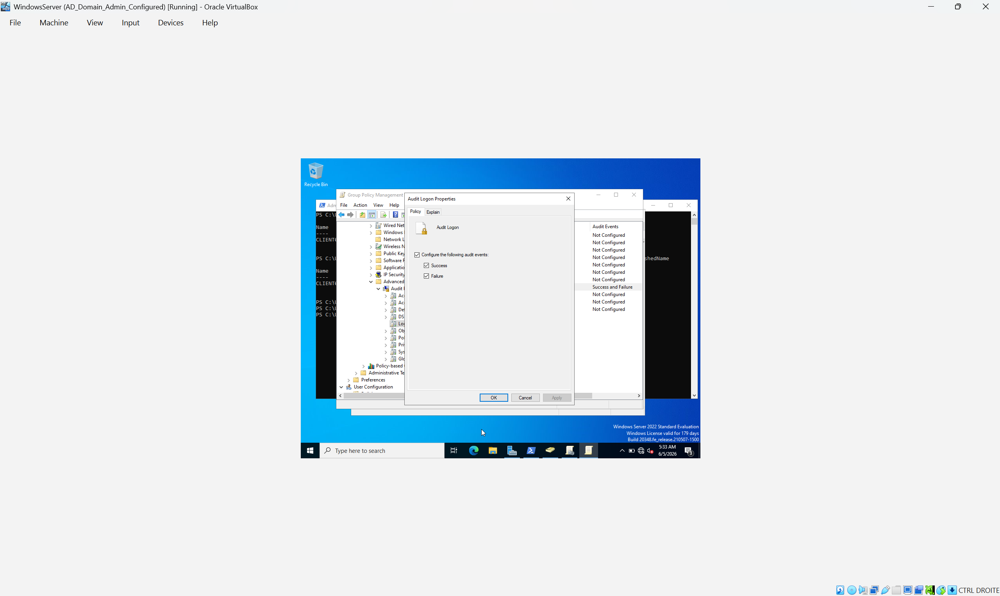
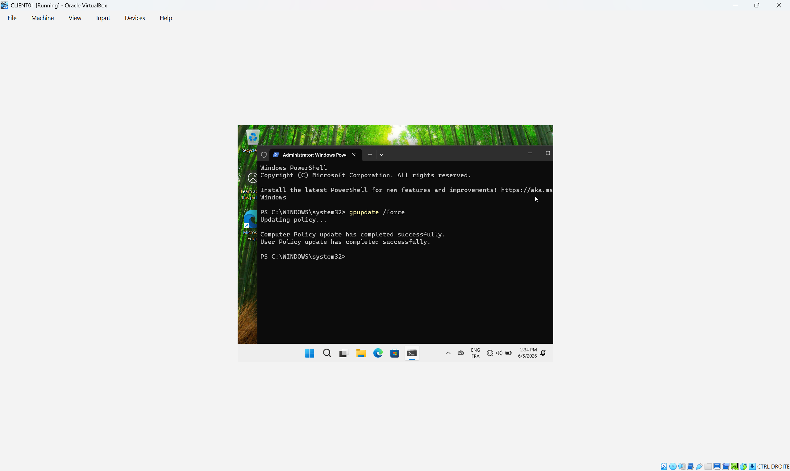
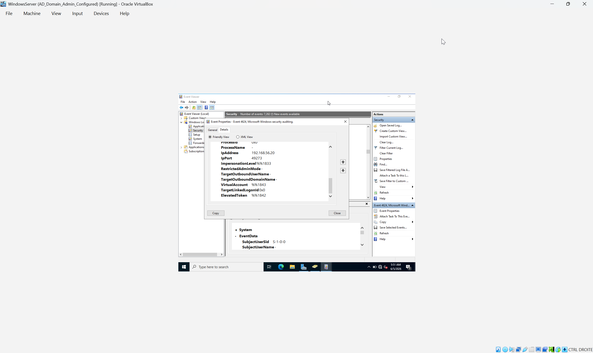
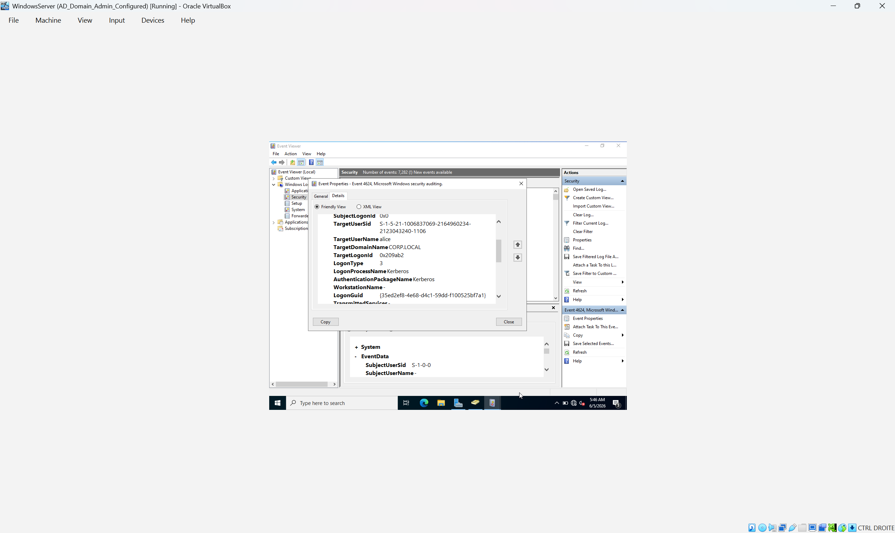
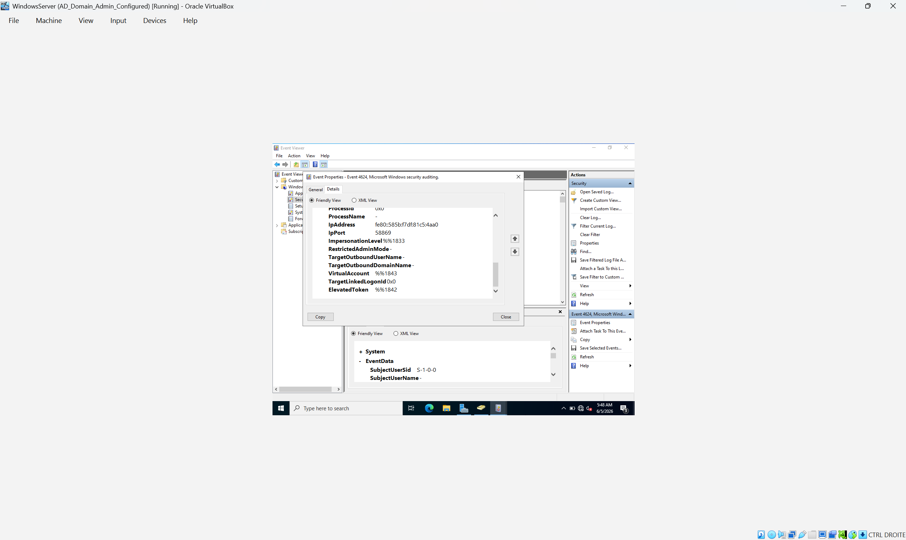
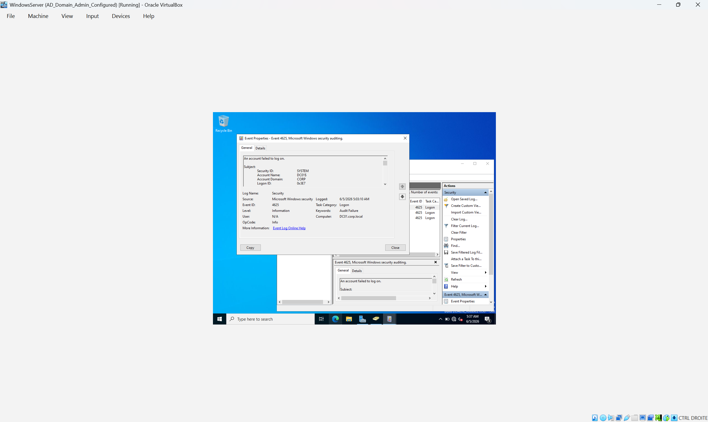
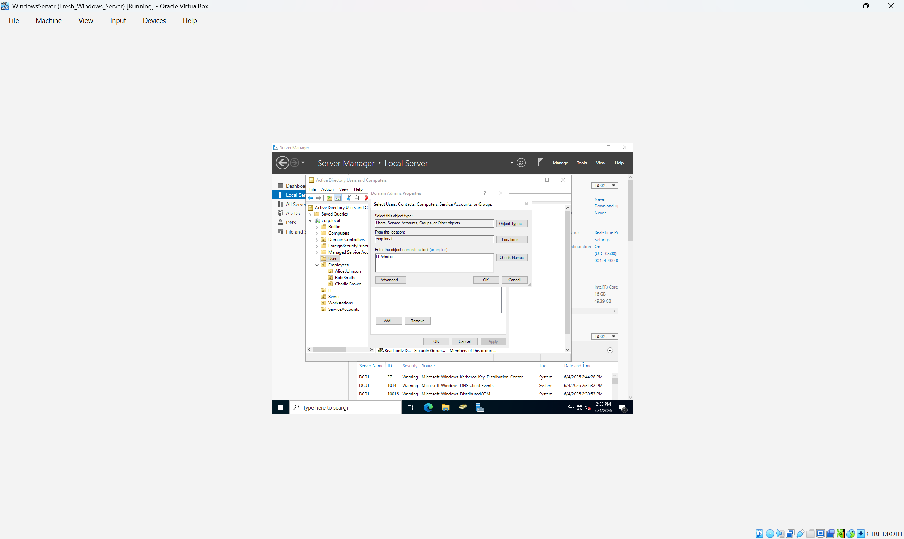

# Active Directory Home Lab

## Project Overview

This project documents the creation of a Windows Active Directory home lab using Oracle VirtualBox, Windows Server 2022, and Windows 11.

The purpose of this lab is to gain hands-on experience with:

- Active Directory Domain Services (AD DS)
- DNS Configuration
- Domain User Management
- Organizational Units (OUs)
- Group Policy Objects (GPOs)
- Kerberos Authentication
- Windows Event Logging
- Security Auditing

---

## Lab Environment

### Virtual Machines

| Machine | Operating System | Role |
|----------|-----------------|------|
| DC01 | Windows Server 2022 | Domain Controller |
| CLIENT01 | Windows 11 | Domain-Joined Workstation |

### Domain Information

| Setting | Value |
|----------|---------|
| Domain Name | corp.local |
| Domain Controller | DC01 |
| Client Workstation | CLIENT01 |

---

## Network Topology


## Technologies Used

- Oracle VirtualBox
- Windows Server 2022
- Windows 11
- Active Directory Domain Services
- DNS
- Group Policy Management
- Event Viewer
- PowerShell

---

## Project Objectives

- Deploy Active Directory Domain Services
- Create and manage domain users
- Join a workstation to the domain
- Organize resources using Organizational Units
- Configure Group Policy Objects
- Enable logon auditing
- Monitor security events
- Investigate authentication activity

---

## Active Directory Structure

```text
corp.local
│
├── Employees
│   ├── Alice Johnson
│   ├── Bob Smith
│   └── Charlie Brown
│
├── Workstations
│   └── CLIENT01
│
├── Servers
│
└── Managed Service Accounts
```

---

## Security Auditing

Configured Group Policy to audit:

- Successful Logons
- Failed Logons

Relevant Event IDs:

| Event ID | Description |
|-----------|-------------|
| 4624 | Successful Logon |
| 4625 | Failed Logon |

---

### Interactive Logon Banner

Configured a legal notice displayed before user logon.



### Audit Logon Policy

Enabled auditing for successful and failed logons.



### Group Policy Refresh

Applied the updated policy settings on CLIENT01.



### Successful Logon Event (Event ID 4624)

Verified successful domain authentication events.








### Failed Logon Event (Event ID 4625)

Verified failed authentication attempts.



### Domain Admin Membership

Verified administrative privileges.



## Lessons Learned

During this project I learned:

- DNS is critical for Active Directory functionality.
- Kerberos authentication depends heavily on proper DNS configuration.
- Domain users and computers can be organized using OUs.
- Group Policy can be used to centrally manage security settings.
- Windows Event Viewer provides valuable security auditing information.
- Security events can be used to investigate authentication activity.

---

## Future Improvements

- Implement Password Complexity Policies
- Configure Account Lockout Policies
- Deploy a Windows File Server
- Configure Shared Folder Permissions
- Add Additional Domain-Joined Workstations
- Integrate a SIEM Platform (Splunk or Wazuh)
- Centralize Windows Event Log Collection
- Implement Group Policy Security Hardening

## Skills Demonstrated

- Active Directory Domain Services (AD DS)
- DNS Configuration
- Organizational Unit Management
- User and Group Administration
- Domain Join Operations
- Group Policy Management
- Windows Security Auditing
- Event Log Analysis
- Kerberos Authentication
- Windows Server Administration

## Author

**Suganthi Sona**

Cybersecurity Student

GitHub: https://github.com/Suga-thamil

Cybersecurity Student
